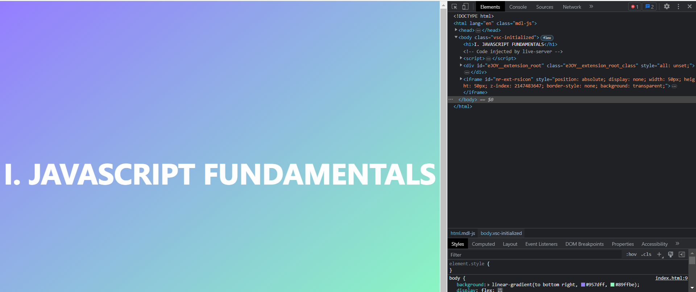
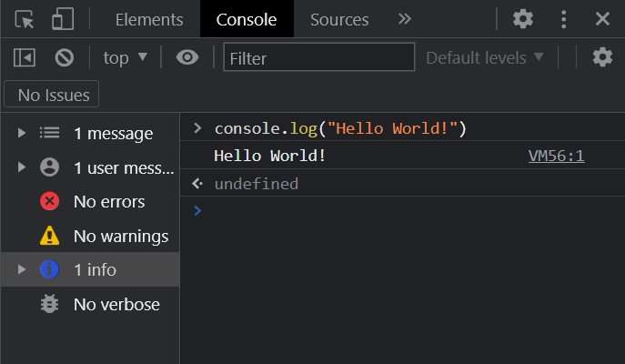

<h1> I. Javascript Fundamentals </h1>

<h2> Table of Contents </h2>

- [1. What is Javascript?](#1-what-is-javascript)
- [2. Hello World!](#2-hello-world)
- [3. Data Types and Variables](#3-data-types-and-variables)
- [4. Operators and Equality](#4-operators-and-equality)
- [5. Logic and Control Flow](#5-logic-and-control-flow)
- [6. Functions](#6-functions)

## 1. What is Javascript?

JavaScript is a programming language that's used to create interactive websites and web applications. It runs on your web browser and allows developers to make web pages that can respond to user actions. It's a versatile language that can be used for many different things, like creating mobile apps or controlling hardware devices. Think of it as a tool that web developers use to make websites more interactive and interesting for users. 

If you want know more about History of Js, you can read it in [here](https://en.wikipedia.org/wiki/JavaScript)

According to recent polls, JavaScript (JS) is the most popular programming language today, with 64.96% of developers utilizing it.* Has such popularity made you excited to be one of those 64.96% programmers? Let's get started!


## 2. Hello World!

Same as other programming languages, we will start with a simple "Hello World!" program. 

```javascript
console.log("Hello World!");
```

The `console.log()` function is used to print the output to the console.

But, how do we run this code? Luckily, there are many ways to run JavaScript code. You really don't need IDEs or editors to run JavaScript code. You can run it directly in your browser's console.

First, create a new file `index.html`. Then, add the following code in [here](code/index.html) to the file and save it. Then, open the file in your browser. Right click on the page and select `Inspect` or you can press `F12` on your keyboard. Then, click on the `Console` tab. You will see something like this:



Switch to the `Console` tab and type the code above and press `Enter`. You will see the output in the console.

```javascript
console.log("Hello World!");
```

When you see the output, you have successfully run your first JavaScript code. Congratulations!



In another way, you can also run the code in VS code by installing the `Code Runner` extension. You can find the extension [here](https://marketplace.visualstudio.com/items?itemName=formulahendry.code-runner). After installing the extension, you can run the code by pressing `Ctrl + Alt + N` on your keyboard. 

And finally, you can also run the code in [repl.it](https://repl.it/) or [jsfiddle](https://jsfiddle.net/) or [codepen](https://codepen.io/) or blah blah xD.

## 3. Data Types and Variables

## 4. Operators and Equality

## 5. Logic and Control Flow

## 6. Functions


