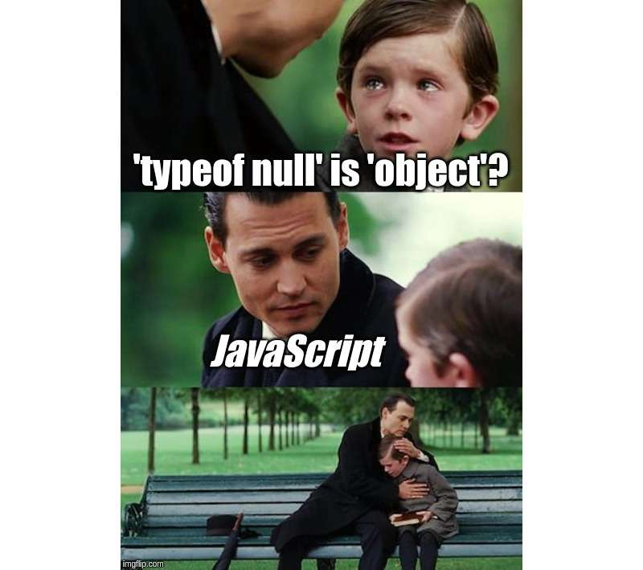

<h1> I. Javascript Fundamentals </h1>

<h2> Table of Contents </h2>

- [1. What is Javascript?](#1-what-is-javascript)
        - [\*Source: Stack Overflow Developer Survey 2020](#source-stack-overflow-developer-survey-2020)
- [2. Hello World!](#2-hello-world)
- [3. Data Types and Variables](#3-data-types-and-variables)
  - [3.1 Data Types](#31-data-types)
  - [3.2 Variables](#32-variables)
    - [3.2.1. Variable Scope](#321-variable-scope)
    - [3.2.2. Difference between `" "` and `' '`?](#322-difference-between---and--)
    - [3.2.3. Inserting Variables into Strings](#323-inserting-variables-into-strings)
    - [3.2.4. typeof Operator](#324-typeof-operator)
- [4. Operators and Equality](#4-operators-and-equality)
- [5. Logic and Control Flow](#5-logic-and-control-flow)
- [6. Functions](#6-functions)

## 1. What is Javascript?

JavaScript is a programming language that's used to create interactive websites and web applications. It runs on your web browser and allows developers to make web pages that can respond to user actions. It's a versatile language that can be used for many different things, like creating mobile apps or controlling hardware devices. Think of it as a tool that web developers use to make websites more interactive and interesting for users. 

If you want know more about History of Js, you can read it in [here](https://en.wikipedia.org/wiki/JavaScript)

According to recent polls, JavaScript (JS) is the most popular programming language today, with 65.36% of developers utilizing it.* Has such popularity made you excited to be one of those 64.96% programmers? Let's get started!


**Source: [Stack Overflow Developer Survey 2022](https://survey.stackoverflow.co/2022/#technology)*

## 2. Hello World!

Same as other programming languages, we will start with a simple "Hello World!" program. 

```javascript
console.log("Hello World!");
```

The `console.log()` function is used to print the output to the console.

But, how do we run this code? Luckily, there are many ways to run JavaScript code. You really don't need IDEs or editors to run JavaScript code. You can run it directly in your browser's console.

First, create a new file `index.html`. Then, add the following code in [here](code/index.html) to the file and save it. Then, open the file in your browser. Right click on the page and select `Inspect` or you can press `F12` on your keyboard. Then, click on the `Console` tab. You will see something like this:


Switch to the `Console` tab and type the code above and press `Enter`. You will see the output in the console.

```javascript
console.log("Hello World!");
```

When you see the output, you have successfully run your first JavaScript code. Congratulations!


In another way, you can also run the code in VS code by installing the `Code Runner` extension. You can find the extension [here](https://marketplace.visualstudio.com/items?itemName=formulahendry.code-runner). After installing the extension, you can run the code by pressing `Ctrl + Alt + N` on your keyboard. 

And finally, you can also run the code in [repl.it](https://repl.it/) or [jsfiddle](https://jsfiddle.net/) or [codepen](https://codepen.io/) or blah blah xD.

Additionally, to comment a line of code, you can use `//` or `/* */`. For example:

```javascript
// This is a comment

/*
This is also a comment
*/
```


## 3. Data Types and Variables

### 3.1 Data Types

In JavaScript, there are 7 data types:

|String|Number|Boolean|Null|Undefined|Symbol|Object|
|:---:|:---:|:---:|:---:|:---:|:---:|:---:|
|`"Hello World"`|`123`|`true` or `false`|`null`|`undefined`|Extremely rarely used|{}|

Among them, **Object** is the most important one and forms the building blocks for modern JavaScript. 

### 3.2 Variables

To declare a variable, you can use `var`, `let` or `const`. For example:

```javascript
var a = 1; // var is the old way to declare a variable
let b = 2; // let is the new way to declare a variable (from ES6)
const c = 3; // const is used to declare a constant variable
```

You can also declare multiple variables in one line:

```javascript
var a = 1, b = 2, c = 3;
```

Let's compare the difference between `var`, `let` and `const`:

```javascript
var a = 1;
var a = 2;
console.log(a); // 2

let b = 1;
let b = 2; // SyntaxError: Identifier 'b' has already been declared

const c = 1;
c = 2; // TypeError: Assignment to constant variable.
```

 

As you can see, `var` and `let` can be declared multiple times, but `const` can only be declared once.

Let check some rules for naming variables:
1. Should be unique
2. Should not be any reserved keywords
3. Must start with a letter, underscore `_` or dollar sign `$`

#### 3.2.1. Variable Scope

The scope of a variable is the region of your program in which it is defined. JavaScript has two types of scope:

1. **Global scope**: A variable declared outside a function definition is a global variable, and its value is accessible and modifiable throughout your program. A global variable has global scope. The lifetime of a global variable starts when your program is executed and ends when your program terminates.
2. **Local scope**: A variable declared within a function definition is local. It is created and destroyed every time the function is executed, and it cannot be accessed by any code outside the function. A local variable has local scope. The lifetime of a local variable starts when the function is executed and ends when the function is completed.

```javascript
var a = 1; // global variable

function test() {
    var b = 2; // local variable
    console.log(a); // 1
    console.log(b); // 2
}

test();
console.log(a); // 1
console.log(b); // ReferenceError: b is not defined
```

#### 3.2.2. Difference between `" "` and `' '`?

There is no difference between `" "` and `' '`. You can use either of them. They can use to declare a string. For example:

```javascript
var a = "Hello World!";
var b = 'Hello World!'; 
```

#### 3.2.3. Inserting Variables into Strings

You can insert variables into strings by using the `${}` syntax. For example:

```javascript
var a = "Hello";

console.log(`${a} World!`); // Hello World!
```

This is called **Template Literals**. You can read more about it [here](https://developer.mozilla.org/en-US/docs/Web/JavaScript/Reference/Template_literals). This way is much easier than using `+` to concatenate strings.

#### 3.2.4. typeof Operator

To check the type of a variable, you can use the `typeof` operator. For example:

```javascript
var a = 1;
var b = "Hello World!";
var c = true;

console.log(typeof a); // number
console.log(typeof b); // string
console.log(typeof c); // boolean
```

Trust me, sometimes the result of `typeof` operator is a little bit confusing. For example:

```javascript
var a = null;
var b = NaN;
var c = {};

console.log(typeof a); // object
console.log(typeof b); // number
console.log(typeof c); // object
```



Therefore, JavaScript's dynamic typing is good and bad at the same time. It's good because you don't have to indicate the variable's type. It's bad because you can never be sure about the variable's type. 

The reason why typeof null returns 'object' in JavaScript is actually a historical accident that has been inherited from the language's early days.

When JavaScript was first created, its data types were defined using a set of tags or "type codes." The type code for an object was 0x1, and the type code for null was 0x0. However, the type code for null shared the same value as the type code for a machine word (which is a unit of data that can be processed by a computer's CPU), which caused confusion in some parts of the implementation.

To work around this issue, the creators of JavaScript decided to use the type code for an object to represent null instead. As a result, the typeof null expression returns 'object'.

However, it's worth noting that null is not actually an object in JavaScript. It is a primitive value that represents the intentional absence of any object value. While this historical accident may be confusing, it's not something that is likely to change in the future due to the need to maintain backwards compatibility with existing code.

## 4. Operators and Equality

## 5. Logic and Control Flow

## 6. Functions


