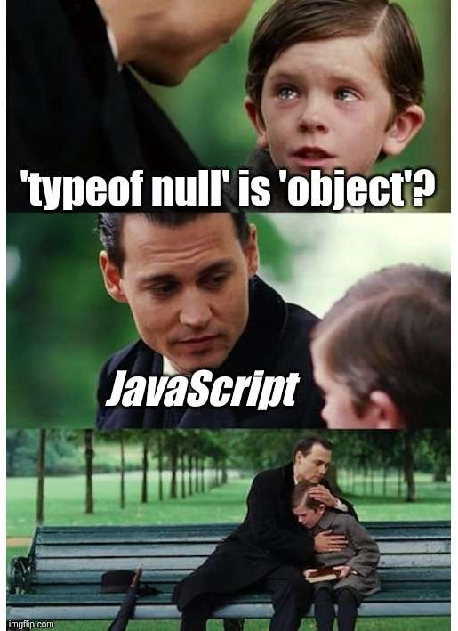
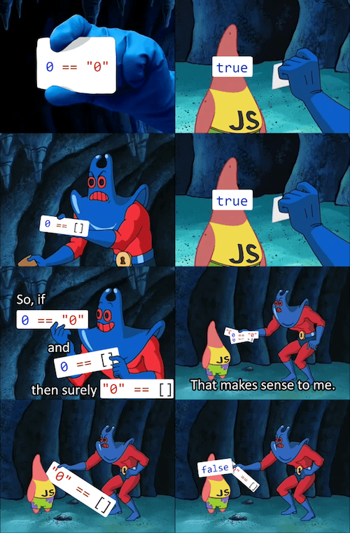

<h1> I. Javascript Fundamentals </h1>

<h2> Table of Contents </h2>

- [1. What is Javascript?](#1-what-is-javascript)
- [2. Hello World!](#2-hello-world)
- [3. Data Types and Variables](#3-data-types-and-variables)
  - [3.1. Data Types](#31-data-types)
  - [3.2. Variables](#32-variables)
    - [3.2.1. Variable Scope](#321-variable-scope)
    - [3.2.2. Difference between `" "` and `' '`?](#322-difference-between---and--)
    - [3.2.3. Inserting Variables into Strings](#323-inserting-variables-into-strings)
    - [3.2.4. typeof Operator](#324-typeof-operator)
    - [3.2.5. Type Conversion](#325-type-conversion)
    - [3.2.6. Number](#326-number)
      - [3.2.6.1. NaN](#3261-nan)
    - [3.2.7. Null and Undefined](#327-null-and-undefined)
    - [3.2.8. Object](#328-object)
      - [3.2.8.1. Array](#3281-array)
  - [3.3. Statically typed vs. dynamically typed](#33-statically-typed-vs-dynamically-typed)
- [4. Operators and Equality](#4-operators-and-equality)
  - [4.1. Strict mode](#41-strict-mode)
  - [4.2. Comparison Operators](#42-comparison-operators)
  - [4.3. Logical Operators](#43-logical-operators)
- [5. Logic and Control Flow](#5-logic-and-control-flow)
  - [5.1. If statement: Truthy and Falsy values](#51-if-statement-truthy-and-falsy-values)
  - [5.2. While statement](#52-while-statement)
  - [5.3. For statement](#53-for-statement)
  - [5.3. Switch statement: Ternary operator](#53-switch-statement-ternary-operator)
- [6. Functions](#6-functions)
  - [6.1. Function declaration](#61-function-declaration)
  - [6.2. Function call](#62-function-call)
  - [6.3. Function expression](#63-function-expression)
  - [6.4. Arrow function](#64-arrow-function)

## 1. What is Javascript?


JavaScript is a programming language that's used to create interactive websites and web applications. It runs on your web browser and allows developers to make web pages that can respond to user actions. It's a versatile language that can be used for many different things, like creating mobile apps or controlling hardware devices. Think of it as a tool that web developers use to make websites more interactive and interesting for users. 

If you want know more about History of Js, you can read it in [here](https://en.wikipedia.org/wiki/JavaScript)

According to recent polls, JavaScript (JS) is the most popular programming language today, with 65.36% of developers utilizing it.* Has such popularity made you excited to be one of those 65.36% programmers? Let's get started!

<!--  -->

**Source: [Stack Overflow Developer Survey 2022](https://survey.stackoverflow.co/2022/#technology)*

## 2. Hello World!

Same as other programming languages, we will start with a simple "Hello World!" program. 

```javascript
console.log("Hello World!");
```

The `console.log()` function is used to print the output to the console.

But, how do we run this code? Luckily, there are many ways to run JavaScript code. You really don't need IDEs or editors to run JavaScript code. You can run it directly in your browser's console.

First, create a new file `index.html`. Then, add the following code in [here](code/index.html) to the file and save it. Then, open the file in your browser. Right click on the page and select `Inspect` or you can press `F12` on your keyboard. Then, click on the `Console` tab. You will see something like this:


Switch to the `Console` tab and type the code above and press `Enter`. You will see the output in the console.

```javascript
console.log("Hello World!");
```

When you see the output, you have successfully run your first JavaScript code. Congratulations!


In another way, you can also run the code in VS code by installing the `Code Runner` extension. You can find the extension [here](https://marketplace.visualstudio.com/items?itemName=formulahendry.code-runner). After installing the extension, you can run the code by pressing `Ctrl + Alt + N` on your keyboard. 

And finally, you can also run the code in [repl.it](https://repl.it/) or [jsfiddle](https://jsfiddle.net/) or [codepen](https://codepen.io/) or blah blah xD.

Additionally, to comment a line of code, you can use `//` or `/* */`. For example:

```javascript
// This is a comment

/*
This is also a comment
*/
```


## 3. Data Types and Variables

### 3.1. Data Types

In JavaScript, there are 7 data types:

|String|Number|Boolean|Null|Undefined|Symbol|Object|
|:---:|:---:|:---:|:---:|:---:|:---:|:---:|
|`"Hello World"`|`123`|`true` or `false`|`null`|`undefined`|Extremely rarely used|{}|

Among them, **Object** is the most important one and forms the building blocks for modern JavaScript. 

### 3.2. Variables

To declare a variable, you can use `var`, `let` or `const`. For example:

```javascript
var a = 1; // var is the old way to declare a variable
let b = 2; // let is the new way to declare a variable (from ES6)
const c = 3; // const is used to declare a constant variable
```

You can also declare multiple variables in one line:

```javascript
var a = 1, b = 2, c = 3;
```

Let's compare the difference between `var`, `let` and `const`:

```javascript
var a = 1;
var a = 2;
console.log(a); // 2

let b = 1;
let b = 2; // SyntaxError: Identifier 'b' has already been declared

const c = 1;
c = 2; // TypeError: Assignment to constant variable.
```

 

As you can see, `var` can be re-declared and updated. `let` can be updated but not re-declared. `const` can neither be updated nor re-declared.

Let check some rules for naming variables:
1. Should be unique
2. Should not be any reserved keywords
3. Must start with a letter, underscore `_` or dollar sign `$`

#### 3.2.1. Variable Scope

The scope of a variable is the region of your program in which it is defined. JavaScript has two types of scope:

1. **Global scope**: A variable declared outside a function definition is a global variable, and its value is accessible and modifiable throughout your program. A global variable has global scope. The lifetime of a global variable starts when your program is executed and ends when your program terminates.
2. **Local scope**: A variable declared within a function definition is local. It is created and destroyed every time the function is executed, and it cannot be accessed by any code outside the function. A local variable has local scope. The lifetime of a local variable starts when the function is executed and ends when the function is completed.

```javascript
var a = 1; // global variable

function test() {
    var b = 2; // local variable
    console.log(a); // 1
    console.log(b); // 2
}

test();
console.log(a); // 1
console.log(b); // ReferenceError: b is not defined
```

Let compare the difference between `var` and `let`:

|var|let|
|:---:|:---:|
|Function scoped|Block scoped|
|Can be re-declared|Cannot be re-declared|
|Hoisting occurs|Hoisting does not occur|

- **Scope**: Redeclaring a variable with `var` in a different scope or block changes the value of the outer variable too. But redeclaring a variable with `let` in a different scope or block treats that variable as a different variable. And the value of a variable outside does not change. For example:

```javascript
vr a = 5;
console.log(a); // 5
{
   var a = 10;
   console.log(a); // 10
}
console.log(a); // 10

let b = 5;
console.log(b); // 5
{
   let b = 10;
   console.log(b); // 10
}
console.log(b); // 5
```

In a loop, `var` will re-declare the variable for each iteration. But `let` will not. For example:

```javascript
var i = 1;
for (var i = 0; i < 5; i++) {
    console.log(i); // 0 1 2 3 4
}
console.log(i); // 5

let j = 1;
for (let j = 0; j < 5; j++) {
    console.log(j); // 0 1 2 3 4
}
console.log(j); // 1
```

- **Hoisting**: Hoisting is JavaScript's default behavior of moving all declarations to the top of the current scope (to the top of the current script or the current function). The variables declared with `var` are hoisted to the top of the scope of the program but the keyword `let` does not allow hoisting. For example:

```javascript
console.log(a); // undefined (not an error)
var a = 1;

console.log(b); // ReferenceError: b is not defined
let b = 1;
```


#### 3.2.2. Difference between `" "` and `' '`?

There is no difference between `" "` and `' '`. You can use either of them. They can use to declare a string. For example:

```javascript
var a = "Hello World!";
var b = 'Hello World!'; 
```

#### 3.2.3. Inserting Variables into Strings

You can insert variables into strings by using the `${}` syntax. For example:

```javascript
var a = "Hello";

console.log(`${a} World!`); // Hello World!
```

This is called **Template Literals**. You can read more about it [here](https://developer.mozilla.org/en-US/docs/Web/JavaScript/Reference/Template_literals). This way is much easier than using `+` to concatenate strings.

#### 3.2.4. typeof Operator

To check the type of a variable, you can use the `typeof` operator. For example:

```javascript
var a = 1;
var b = "Hello World!";
var c = true;

console.log(typeof a); // number
console.log(typeof b); // string
console.log(typeof c); // boolean
```

Trust me, sometimes the result of `typeof` operator is a little bit confusing. For example:

```javascript
var a = null;
var b = NaN;
var c = {};

console.log(typeof a); // object
console.log(typeof b); // number
console.log(typeof c); // object
```



Therefore, JavaScript's dynamic typing is good and bad at the same time. It's good because you don't have to indicate the variable's type. It's bad because you can never be sure about the variable's type. 

The reason why typeof null returns 'object' in JavaScript is actually a historical accident that has been inherited from the language's early days.

When JavaScript was first created, its data types were defined using a set of tags or "type codes." The type code for an object was 0x1, and the type code for null was 0x0. However, the type code for null shared the same value as the type code for a machine word (which is a unit of data that can be processed by a computer's CPU), which caused confusion in some parts of the implementation.

To work around this issue, the creators of JavaScript decided to use the type code for an object to represent null instead. As a result, the typeof null expression returns 'object'.

However, it's worth noting that null is not actually an object in JavaScript. It is a primitive value that represents the intentional absence of any object value. While this historical accident may be confusing, it's not something that is likely to change in the future due to the need to maintain backwards compatibility with existing code.

#### 3.2.5. Type Conversion

Type conversion is the process of converting a value from one data type to another (such as string to number, object to boolean, and so on). JavaScript is a dynamically typed language, which means that you don't have to specify the data type of a variable when you declare it. Instead, the data type is determined automatically when the value is assigned to the variable.

```javascript
var a = 1; // number
var b = "Hello World!"; // string
var c = true; // boolean

a = b; // a is now a string
c = 3; // c is now a number
```

However, sometimes you may need to explicitly convert a value from one data type to another if you want javascript understand what you want. For example:

```javascript
var a = 1;
var b = "2";

console.log(a + b); // 12
console.log(a + Number(b)); // 3
```

In the above example, `a` is a number and `b` is a string. When you use `+` to add them together, JavaScript will convert `b` to a number and then add them together. Therefore, the result is `12` instead of `3`.

To know more about type conversion, you can read [this](https://developer.mozilla.org/en-US/docs/Web/JavaScript/Reference/Global_Objects/Number) and [this](https://developer.mozilla.org/en-US/docs/Web/JavaScript/Reference/Global_Objects/String).

#### 3.2.6. Number

JavaScript has only one type of number. Numbers can be written with or without decimals.

```javascript
var a = 123;
var b = 123.456;
var c = "Hello World!";

var result1 = a + b; // 246.456
var result2 = a + c; // 123Hello World!

var result3 = a / c; // NaN

console.log(typeof result3); // number
```

##### 3.2.6.1. NaN

The reason why typeof NaN returns 'number' in JavaScript is because `NaN` is actually a numeric value, albeit a special one.

`NaN` stands for "Not a Number" and is used to represent the result of a mathematical operation that cannot be represented as a valid number. For example, dividing zero by zero, or taking the square root of a negative number, both result in `NaN`.

In JavaScript, `NaN` is considered to be a numeric value because it is represented using the Number data type. Specifically, `NaN` is a special value of the Number type that represents an "invalid number."

Although `NaN` is not a "real" number in the mathematical sense, it is still considered to be a numeric value in JavaScript because it is represented using the Number data type. As a result, typeof `NaN` returns 'number'.

#### 3.2.7. Null and Undefined

In JavaScript, `null` and `undefined` are two different values that represent the absence of a value. However, they are not the same thing. `null` is an assignment value. It can be assigned to a variable as a representation of no value. `undefined` is a property value. It is automatically assigned to variables that have just been declared, or to formal arguments for which there are no actual arguments.

```javascript
var a; // undefined
var b = null; // null

console.log(typeof a); // undefined
console.log(typeof b); // object
```

#### 3.2.8. Object

An object is a collection of properties, and a property is an association between a name (or key) and a value. A property's value can be a function, in which case the property is known as a method. In addition to objects that are predefined in the browser, you can define your own objects. 

```javascript
var person = {
  name: "John",
  age: 30,
  city: "New York"
};
```

You can access the properties of an object using dot notation. It is also possible to access the properties of an object using square brackets. However, you should use square brackets when the property name contains special characters or when the property name is stored in a variable. For example:

```javascript
console.log(person.name); // John

person.name = "Jane";

console.log(person["name"]); // Jane
```

##### 3.2.8.1. Array

An array is a special type of object that stores a collection of values. The values can be of any data type, including strings, numbers, booleans, objects, and even other arrays. 

```javascript
var fruits = ["Apple", "Banana", "Orange"];

console.log(typeof fruits); // object
console.log(fruits) 
/* ["Apple", "Banana", "Orange"]
   0: "Apple"
   1: "Banana"
   2: "Orange"
   length: 3
   __proto__: Array(0)
*/
```

You can access the elements of an array using square brackets. The index of the first element is 0, and the index of the last element is the length of the array minus 1. For example:

```javascript
var fruits = ["Apple", "Banana", "Orange"];

console.log(fruits[0]); // Apple
console.log(fruits[1]); // Banana
console.log(fruits[2]); // Orange
```

### 3.3. Statically typed vs. dynamically typed

Statically typed languages are those in which the type of a variable is known at compile time. In contrast, dynamically typed languages are those in which the type of a variable is known at run time.

Simply, C++, C or Java is a statically typed language, while JavaScript is a dynamically typed language. To declare a variable in C++, you need to specify the data type of the variable. For example:

```c++
int a = 1; // c++
```

In JavaScript, you don't need to specify the data type of a variable when you declare it. Instead, the data type is determined automatically when the value is assigned to the variable. For example:

```javascript
var a = 1;
console.log(typeof a); // number

a = "Hello World!";
console.log(typeof a); // string
```

## 4. Operators and Equality

### 4.1. Strict mode

Simply, strict mode in JavaScript is a stricter set of rules that can help you avoid common coding mistakes and make your code more secure. When you use strict mode, the JavaScript engine will prevent you from doing things that could potentially cause bugs or security vulnerabilities. To use strict mode, you simply add the string `use strict;` at the beginning of your code.

We have a good answer on StackOverflow in [here](https://stackoverflow.com/questions/1335851/what-does-use-strict-do-in-javascript-and-what-is-the-reasoning-behind-it) about it and the reason why we need strict mode.

### 4.2. Comparison Operators

Comparison operators are used in logical statements to determine equality or difference between variables or values. The result of a comparison is always a boolean: `true` or `false`.

| Operator | Description |
| :--- | :--- |
| `==` | equal to |
| `===` | equal value and equal type |
| `!=` | not equal |
| `!==` | not equal value or not equal type |
| `>` | greater than |
| `<` | less than |
| `>=` | greater than or equal to |
| `<=` | less than or equal to |

For example:

```javascript
var a = 1;
var b = 2;

console.log(a == b); // false
console.log(a != b); // true
```

So, why we have two different operators for equality? The equality operator in javascript is used to compare if two values are equal. The comparison is made by `==` and `===` operators in javascript. The main difference between the `==` and `===` operator in javascript is that the `==` operator does the type conversion of the operands before comparison, whereas the `===` operator compares the values as well as the data types of the operands.

```javascript
var a = 1;
var b = "1";

console.log(a == b); // true
console.log(a === b); // false
```

And again, sometimes we get a few surprises:



To explain this, you can read in [here](https://www.freecodecamp.org/news/explaining-the-best-javascript-meme-i-have-ever-seen/).

In the end, you should always use `===` and `!==` to compare values in JavaScript. (In strict mode, `==` and `!=` are not allowed.)

If you are considering, check [Equality in JavaScript](https://dorey.github.io/JavaScript-Equality-Table/unified/) to see the full table of equality in JavaScript by [@dorey](github.com/dorey) and has realize Moral of the story is *"Always use 3 equals unless you have a good reason to use 2."*

### 4.3. Logical Operators

Logical operators are used to determine the logic between variables or values. The result of a logical operation is always a boolean: `true` or `false`.

| Operator | Description |
| :--- | :--- |
| `&&` | logical AND: All operands must be true for the result to be true. |
| `\|\|` | logical OR: Any operand must be true for the result to be true. |
| `!` | logical NOT: Reverses the result of the operand. |

For example:

```javascript
var a = 1;
var b = 2;

console.log(a == 1 && b == 2); // true
console.log(a == 1 || b == 3); // true
console.log(!(a == 1)); // false
```

## 5. Logic and Control Flow

### 5.1. If statement: Truthy and Falsy values

`If` statement is consisted of a condition has value `true` or `false` and a block of code. The condition is evaluated and if it is `true`, the block of code is executed. For example:

```javascript
var age = 19;
var condition = age >= 18;

if (age >= 18) {
  /* This block of code will be executed if the condition is true */
  console.log("You are an adult");
} else if (13 <= age && age < 18) {
  /* This block of code will be executed if the condition is false */
  console.log("You are a teenager");
} else {
  /* This block of code will be executed if the condition is false */
  console.log("You are a child");
}
```

In JavaScript, there are some values that are considered `false` when evaluated in a boolean context. These values are called falsy values. The following values are falsy:

* `false`
*  `0`
*  `""` (empty string)
*  `null`
*  `undefined`
*  `NaN`
*  `document.all` (in browsers)
*  `0n` (BigInt)

### 5.2. While statement

`While` statement is consisted of a condition has value `true` or `false` and a block of code. The condition is evaluated and if it is `true`, the block of code is executed. After that, the condition is evaluated again and the process repeats until the condition is `false`. For example:

```javascript
var i = 0;
while (i < 10) {
  console.log(i);
  i++;
}
```
### 5.3. For statement

`For` statement is consisted of three expressions, enclosed in parentheses and separated by semicolons, followed by a statement (usually a block statement) to be executed in the loop. We have form of `for` statement:

```javascript
for ([initialExpression]; [conditionExpression]; [incrementExpression]) {
  doSomething();
}
```
For example:
```javascript
for (var i = 0; i < 10; i++) {
  console.log(i);
}
```

### 5.3. Switch statement: Ternary operator

`Switch` statement is used to perform different actions based on different conditions. `Switch` statement is often used together with a `break` or a `default` keyword (or both). For example:

```javascript
var day = 2;

switch (day) {
  case 1:
    console.log("Monday");
    break;
  case 2:
    console.log("Tuesday");
    break;
  case 3:
    console.log("Wednesday");
    break;
  case 4:
    console.log("Thursday");
    break;
  case 5:
    console.log("Friday");
    break;
  case 6:
    console.log("Saturday");
    break;
  case 7:
    console.log("Sunday");
    break;
  default:
    console.log("Invalid day");
}
```

This is useful when you have many conditions to check, each with different actions.

## 6. Functions

This is the most interesting and important part of JavaScript. A function is a block of code designed to perform a particular task. A JavaScript function is executed when "something" invokes it (calls it). For example:

```javascript
function sayHello() {
  console.log("Hello");
}

sayHello();
```

We have two terms about function:
1. Function declaration: that where we define the function
2. Function call: that where we invoking/executing the function

### 6.1. Function declaration
Let's review a function declaration word by word:

```javascript
var name = "John";

function sayHello(name) {
  console.log("Hello ${name}"); // Hello John
}
```

- `function` keyword: that is used to declare a function
- `sayHello`: that is the name of the function
- `name`: that is the parameter of the function. Name of the parameter can be anything you want but don't forget change the name in the body of the function too
- `console.log(f"Hello {name}")`: that is the body of the function

**Rules for naming a function:**
- The name must contain only letters, digits, or the symbols `$` and `_`.
- The first character must not be a digit.
- Reserved words, such as "for", "let", "return", and "class" cannot be used as names. You can find a full list of reserved words [here](https://developer.mozilla.org/en-US/docs/Web/JavaScript/Reference/Lexical_grammar#reserved_words).

Another example:

```javascript

function sum(a, b) {
  return a + b;
}

- `return`: that is used to return a value from a function

```javascript
var a = 1;
var b = 2;

var result = sum(a, b); // 3
```

### 6.2. Function call

To call a function, you need to write the function name followed by parentheses `()`. For example:

```javascript
sayHello();
```

### 6.3. Function expression

```javascript
var sayHello = function(name) {
  console.log("Hello ${name}"); // Hello John
}

sayHello("John");
```

In here, we are setting the value of `sayHello` variable to a function. This is call a function expression. It is very similar to and has almost the same syntax as a function declaration. The main difference between a function expression and a function declaration is the function name, which can be omitted in function expressions to create anonymous functions like above.

### 6.4. Arrow function

```javascript
var sayHello = (name) => {
  console.log("Hello ${name}"); // Hello John
}

sayHello("John");
```

So, we have three ways to declare a function:
1. Function declaration
2. Function expression
3. Arrow function

You don't need to memorize all of them. Arrow functions are the most modern way to declare a function. For that reason, we're going to explore more about them. There's only one advantage of using a function declaration is that they have the access to `this` keyboard.

Let's try to create a function by three ways:

```javascript
// Function declaration
function sum(a, b) {
  return a + b;
}

// Function expression
var sum = function(a, b) {
  return a + b;
}

// Arrow function
var sum = (a, b) => {
  return a + b;
}
```

Every function if it doesn't have a `return` keyword, it will return `undefined`. 

---

So, we have learned about:
- Variables
- Data types
- Operators
- Conditional statements
- Loops 
- Functions

To practice more, you can use all you learned to make a small project. For example, you can make a calculator or a game like Tic Tac Toe or Rock Paper Scissors. Hope you enjoy it and ready to go to the next chapter ^^.

---

( ﾉ ﾟｰﾟ)ﾉ Next Chapter in herer: [II. DOM and Events Fundamentals](https://github.com/kztera/javascript-study/blob/main/ii-DOM-and-events-fundamentals/dom-n-events-fundamentals.md) 


---

***References:***
- [MDN Web Docs](https://developer.mozilla.org/en-US/docs/Web/JavaScript)
- [JavaScript Crash Course 2021 - Master JavaScript in One Video!](https://www.youtube.com/watch?v=g7T23Xzys-A) by [JavaScript Mastery](https://www.youtube.com/@javascriptmastery)

