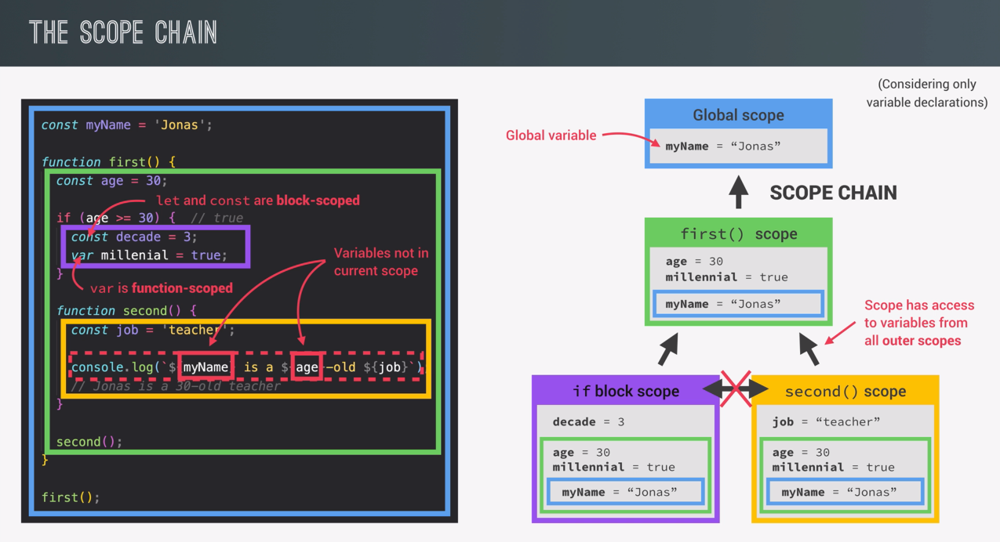

<h1>III. How JavaScript Works Behind the Scenes </h1>

<h2> Table of content </h2>

-  [1. High-level overview of JavaScript](#1-high-level-overview-of-javascript)
-  [2. JavaScript runtime](#2-javascript-runtime)
-  [3. Scoping and scope in JavaScript](#3-scoping-and-scope-in-javascript)
   -  [3.1. Scope concepts](#31-scope-concepts)
   -  [3.2. The 3 types of scope](#32-the-3-types-of-scope)
      -  [3.2.1. Global scope](#321-global-scope)
      -  [3.2.2. Function scope](#322-function-scope)
      -  [3.2.3. Block scope (ES6)](#323-block-scope-es6)

## 1. High-level overview of JavaScript

JavaScript is a language that is:

-  **High-level:** JavaScript is a high-level language, which means that it is very close to human languages. It is easy to read and write. It is also easy to understand.
-  **Garbage-collected:** means that it automatically frees up memory when it is no longer needed. This is a huge advantage over languages like C, where you have to manually free up memory.
-  **Interpreted / Just-in-time compiled:** means that it does not need to be compiled before it is executed.
-  **Multi-paradigm:** In programing, paradigm is an approach and mindset of structuring code, which will direct the coding style and techniques. Sound abstract, right? Now, three most popular paradigms are:
   -  **Procedural:** It's just oganizing code into functions. It's good for small and simple projects.
   -  **Object-oriented:** In object-oriented programming, the program is viewed as a collection of objects that interact with one another. Each object contains data, in the form of fields, and code, in the form of procedures. The main focus of object-oriented programming is on the objects. It is good for large and complex projects.
   -  **Functional programming:** In functional programming, the program is viewed as a mathematical function. The main focus of functional programming is on the evaluation of functions. It is good for large and complex projects.
-  **Prototype-based:** have you ever wondered why we can create an array and then use the push method on it, for example? Well, it's because of prototypal inheritance. Basically, we create arrays from an array blueprint, which is like a template and this is called the prototype. This prototype contains all the array methods and the arrays that we create in our code then inherit the methods from the blueprint so that we can use them on the arrays.
-  **First-class functions**: means that functions are just treated like any other variable. We can pass functions into other functions and return functions from functions. We can also call methods on functions. This is a very powerful feature and it is one of the reasons why JavaScript is so popular.
-  **Dynamically typed:** means that we do not have to manually define the data types of our variables. Instead, data types are determined automatically. This is also a very powerful feature because it saves us a lot of time and makes our code more flexible.
-  **Single-threaded:** means that one command is executed at a time. The next command cannot be executed until the previous command has finished. This is also a very powerful feature because it makes our code more predictable and easier to debug.
-  **Non-blocking:** means that if some time-consuming task is being executed, the JavaScript engine can continue executing other, simpler tasks in the meantime. This is also a very powerful feature because i t makes our code more responsive.

## 2. JavaScript runtime

So we can imagine a JavaScript runtime as a big box or a big container which includes all the things that we need in order to use JavaScript in this case, in the browser. And to heart of any JavaScript, runtime is always a JavaScript engine.
Without an engine there is no runtime and there is no JavaScript at all. However the engine alone is not enough. In order to work properly,we also need access to the web APIs.

Next a typical JavaScript runtime also includes a so called callback queue. This is a data structure that contains all the callback functions that are ready to be executed. For example we attach event handler functions to DOM elements like a button to react to certain events, right? And these event handler function are also called callback functions. And when the event happens, the callback function is pushed into the callback queue. And then the event loop takes care of executing the callback functions in the callback queue one by one. So basically the event loop takes callback functions from the callback queue and puts them in the call stack so that they can be executed.

## 3. Scoping and scope in JavaScript

### 3.1. Scope concepts

-  _Scoping:_ So basically scoping asks the question, _where do variables live?_ Or _where can we access a certain variable and where not?_. Now in JavaScript, we have something called lexical scoping
-  **Lexical scoping** means that the way variables are organized and accessed is entirely controlled by the placement of functions and blocks in the code;
-  **Scope**: Space or environment in which a certain variable is **declared** (varible environment in case of function). There is **global** scope, **funciton** scope and **block** scope.
-  **Scope of a variable:** Region of our code where a certain variable can be accessed.

### 3.2. The 3 types of scope

And remember, scope is the place in our code where variables are declared. And when I say variables, the exact same thing is true for functions as well. Because in the end, functions are just values that are stored in variables.

#### 3.2.1. Global scope

```js
const name = "Nguyen Khoa";
const age = 20;
const job = "Student";
```

So first, the global scope is the default scope in JavaScript. All these variables are declared outside of any function or block. It declared in global scope are accessible **everywhere**

#### 3.2.2. Function scope

```js
function sayHello(name) {
   const greeting = "Hello";
   return `${greeting} ${name}`;
}

console.log(greeting); // Uncaught ReferenceError: greeting is not defined
```

-  Variables are accessible only **inside the function**, **NOT** outside.
-  Not accessible at all. Just can use inside the function.
-  Also called local scope.

#### 3.2.3. Block scope (ES6)

Since ES6, we have a new type of scope called block scope. And block scope is basically the same as function scope, but for blocks instead of functions. Example: `if` block, `for` loop block, etc. . .

```js
for (let i = 0; i < 10; i++) {
   console.log(i);
}

if (age > 18) {
   const isAdult = true;
}

console.log(i); // Uncaught ReferenceError: i is not defined
console.log(isAdult); // Uncaught ReferenceError: isAdult is not defined
```

-  Variables aare accessible only **inside the block**
-  This only applies to `let` and `const` variables.
-  Funtions are also **block scoped** (only in strict mode).

So, if I declared a variable with `var`, then it would actually still be accessible outside of the block.

Conclusion, Scopes simplyt look up in the scope chain to find the variable. If it can't find it, it will throw an error. **BUT**, it does not work the other way around. A certain scope will never, ever have access to the variables of an inner scope.

We have an good example in course (I want to talk about the course by Jonas Schmedtmann):

